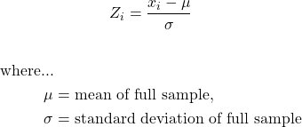
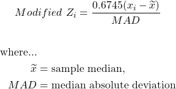

```{r, include=FALSE}
library(fluoR)
library(ggplot2)
library(ggpubr)
library(cowplot)
theme_set(theme_pubclean())

df <- format_data(GCaMP)
```

Analyzing calcium indicator data is a multi-step process that can be very confusing for both novices and seasoned scientists.

# Step 1: Convert to fluoR format

After exporting your recorded data from your preferred software (e.g. MATLAB, Doric software), the first step is to convert your data for quick use with the fluoR package. The `format_data` function is used for this. 

There are two formats of data supported as input:

<u><b> 1. Vertical format </u></b>

* timestamps in the first column
* one column for each trial's recorded values

<u><b> 2. Horizontal format </u></b>

- timestamps in the first row
- one row for each trial's recorded values

## How it works

The input can be a matrix or data frame - labeled or unlabeled. The function detects whether the number of rows are greater than the number of columns (vertical) and vice versa (horizontal). 

If the input is horizontal, then the object is transposed to vertical format. The table is then converted to a data frame, with each column being labeled. This makes manually working with the data more convenient and R-friendly.

## Output

The below table is an informal matrix representation of what the returned data frame will look like.


# Step 2: Standardize your data

There are many reasons to standardize your data before exploring your data. 

<b><u> 1. Signal differs between subjects </b></u>

- Regardless of the specific technologies used, there is almost always differences in signal strength for each subject

<b><u> 2. Signal differs between trials </b></u>

- The strength of recording signal tends to decay over time

<b><u> 3. Utilizing baseline values </b></u>

- Using transformations such as percent change allows you to center the data at an objective value
- After centering your trial and post-trial data, the data is interpreted as relative to baseline values
- The baseline period is typically assumed to be a "resting" period prior to exposure to the experimental manipulation. This means that using standardization methods (particularly z-scores) also takes baseline <i>deviations</i> into consideration.

## Methods of Standardization

A little alteration in how we compute z-scores can make a significant difference.

### z-scores 

Consider the traditional z-score computation. This centers every value (x) at the mean of the full time series (mu) and divides it by the standard deviation of the full time series (sigma).

<!-- 
\begin{gather*}
  Baseline \ Z_{i} = \frac{x_{i}-\mu}{\sigma}
\end{gather*}
\begin{align*}
  \text{where...} \\
  \mu &= \text{mean of full sample,} \\
  \sigma &= \text{standard deviation of full sample} \\
\end{align*}
-->

<BR>



<BR>

This results in the same time series in terms of standard deviations from the mean, all in the context of the full time series.

##### R Code

```{r}
z.scores <- z_score(xvals = df$Trial8,
                    mu = mean(df$Trial8), # manual input of mu/sigma optional;
                    sigma = sd(df$Trial8)) # used for example purposes
```

##### Visualization

```{r, include=FALSE}
df.zscores <- data.frame(
  Time = df$Time,
  Values = df$Trial8,
  Zscores = z.scores
)
```

```{r, echo=FALSE}
### Graph 1
z.graph1 <- ggplot(df.zscores) + 
  geom_vline(xintercept = 0,
             color = 'red', alpha = 0.075) +
  geom_line(aes(x = Time, y = Values)) +
  labs(
    x = 'Time Post-Onset',
    title = 'raw values'
  ) +
  theme(
    axis.ticks = element_blank(),
    axis.title.y = element_blank()
  )

### Graph 2
z.graph2 <- ggplot(df.zscores) + 
  geom_vline(xintercept = 0,
             color = 'red', alpha = 0.075) +
  geom_line(aes(x = Time, y = Zscores)) +
  labs(
    x = 'Time Post-Onset',
    title = 'z scores'
  ) +
  theme(
    axis.ticks = element_blank(),
    axis.title.y = element_blank()
  )

### Finishing touches for 2x graph
plot_grid(z.graph1, z.graph2, ncol = 1, 
          nrow = 2, align = 'v')
```

### baseline z-scores 

Using the pre-event baseline period as the input values for computing z-scores can be useful in revealing differences from baseline that you may not find by just  comparing pre-trial and trial periods. This is in part because baseline periods tend to have relatively low variability in general. 

As you can see from the formula, a lower standard deviation will increase positive values and decrease negative values - thus making changes in neural activity more apparent.

<!--
\begin{gather*}
  Baseline Z_{i} = \frac{x_{i}-\mu_{baseline}}{\sigma_{baseline}}
\end{gather*}
\begin{align*}
  \text{where...} \\
  \mu_{baseline} &= \text{mean of values from baseline period,} \\
  \sigma_{baseline} &= \text{standard deviation of values from baseline period} \\
\end{align*}
-->

<BR>


<BR>

This results in a time series interpreted in terms of standard deviations and mean during the baseline period. Baseline z-scores are conceptually justifiable because the standard deviation is then the number of deviations from the mean when a subject is at rest. The values outside of the baseline period will be different using this version, but not within the baseline period.

##### R Code

```{r}
### Extract baseline values
baseline.vals <- df$Trial8[df$Time >= -4 & df$Time <= 0]

### Compute z-scores
z.scores.baseline <- z_score(xvals = df$Trial8,
                             mu = mean(baseline.vals),
                             sigma = sd(baseline.vals))
```

##### Visualization

```{r, include=FALSE}
df.base.zscores <- data.frame(
  Time = df$Time,
  Values = df$Trial8,
  Zscores = z.scores.baseline
)
```

```{r, echo=FALSE}
### Graph 1
zbase.graph1 <- ggplot(df.base.zscores) + 
  geom_vline(xintercept = 0,
             color = 'red', alpha = 0.075) +
  geom_line(aes(x = Time, y = Values)) +
  labs(
    x = 'Time Post-Onset',
    title = 'raw values'
  ) +
  theme(
    axis.ticks = element_blank(),
    axis.title.y = element_blank()
  )

### Graph 2
zbase.graph2 <- ggplot(df.base.zscores) + 
  geom_vline(xintercept = 0,
             color = 'red', alpha = 0.075) +
  geom_line(aes(x = Time, y = Zscores)) +
  labs(
    x = 'Time Post-Onset',
    title = 'z-scores from baseline'
  ) +
  theme(
    axis.ticks = element_blank(),
    axis.title.y = element_blank()
  )

### Finishing touches for 2x graph
plot_grid(zbase.graph1, zbase.graph2, ncol = 1, 
          nrow = 2, align = 'v')
```

### modified z scores

Waveform data fluctuates naturally. But in the event of a change in activity due to external stimuli, signal variation tends to rapidly increase and/or decrease and becomes unruly. 

<!--
\begin{gather*}
  Modified \ Z_{i} = \frac{0.6745(x_{i}-\widetilde{x})}{MAD}
\end{gather*}
\begin{align*}
  \text{where...} \\
  \widetilde{x} &= \text{sample median,} \\
  MAD &= \text{median absolute deviation}
\end{align*}
-->

<BR>



<BR>

##### R Code

```{r}
z.scores.modified <- z_score(xvals = df$Trial8, 
                             z.type = 'modified')
```

##### Visualization

```{r, include=FALSE}
df.mod.zscores <- data.frame(
  Time = df$Time,
  Values = df$Trial8,
  Zscores = z.scores.modified
)
```

```{r, echo=FALSE}
### Graph 1
zmod.graph1 <- ggplot(df.mod.zscores) + 
  geom_vline(xintercept = 0,
             color = 'red', alpha = 0.075) +
  geom_line(aes(x = Time, y = Values)) +
  labs(
    x = 'Time Post-Onset',
    title = 'raw values'
  ) +
  theme(
    axis.ticks = element_blank(),
    axis.title.y = element_blank()
  )

### Graph 2
zmod.graph2 <- ggplot(df.mod.zscores) + 
  geom_vline(xintercept = 0,
             color = 'red', alpha = 0.075) +
  geom_line(aes(x = Time, y = Zscores)) +
  labs(
    x = 'Time Post-Onset',
    title = 'modified z scores'
  ) +
  theme(
    axis.ticks = element_blank(),
    axis.title.y = element_blank()
  )

### Finishing touches for 2x graph
plot_grid(zmod.graph1, zmod.graph2, ncol = 1, 
          nrow = 2, align = 'v')
```

# z-score comparison

##### Visualization

```{r, include=FALSE}
### Construct data frame
df.graph <- data.frame(
  Time = c(df$Time, df$Time, df$Time),
  Values = c(z.scores, z.scores.baseline, z.scores.modified),
  Type = as.character(c(rep.int("Standard", times = length(z.scores)), 
                        rep.int("Baseline", times = length(z.scores)),
                        rep.int("Modified", times = length(z.scores)))),
  stringsAsFactors = TRUE
)

df.graph$Type = factor(df.graph$Type, levels = c("Standard", "Baseline", "Modified"))
```

```{r, echo=FALSE}
### Graph
ggplot(df.graph) +
  geom_vline(xintercept = 0,
             color = 'red',
             alpha = 0.075) +
  geom_line(aes(x = Time, y = Values)) +
  facet_grid(Type ~ .) +
  labs(
    x = 'Time Post-Onset',
    y = 'z score'
  ) +
  theme(
    axis.ticks = element_blank()
  )
```

## Summary table


### percent change from baseline

Researchers often center data at a pre-event baseline for visualizations to improve interpretation and emphasize change due to an experimental manipulation. This can be especially useful for presenting to more "naive" audiences who may not know what z-scores are. 

This tends to be fine. The major issue is that, unlike z-scores, using percent change from baseline with time series data does not account for changes in deviations and should be mostly used for interpretation and presentation purposes, if appropriate.

##### R Code

```{r}
### Extract baseline values
baseline.vals <- df$Trial8[df$Time >= -4 & df$Time <= 0]

### Compute percent change from baseline
perc.change <- percent_change(xvals = df$Trial8,
                              base.val = mean(baseline.vals))
```

```{r, include=FALSE}
df.percchange <- data.frame(
  Time = df$Time,
  Values = df$Trial8,
  Percent.Change = perc.change
)
```

##### Visualization

```{r, echo=FALSE}
### Graph
pc.graph1 <- ggplot(df.percchange) + 
  geom_vline(xintercept = 0,
             color = 'red',
             alpha = 0.075) +
  geom_line(aes(x = Time, y = Values)) +
  labs(
    x = 'Time Post-Onset',
    title = 'Raw Values',
    y = 'Raw Values'
  ) +
  theme(
    axis.ticks = element_blank(),
    axis.title.y = element_blank()
  )

### Graph
pc.graph2 <- ggplot(df.percchange) +
  geom_vline(xintercept = 0,
             color = 'red',
             alpha = 0.075) +
  geom_line(aes(x = Time, y = Percent.Change)) +
  labs(
    x = 'Time Post-Onset',
    title = '% Change from Baseline',
    y = 'Percent Change'
  ) +
  theme(
    axis.ticks = element_blank(),
    axis.title.y = element_blank()
  )

### Finishing touches for 2x graph
plot_grid(pc.graph1, pc.graph2, ncol = 1, 
          nrow = 2, align = 'v')#, #vjust = -0.5,
          #labels = c('Raw Values', '% Change from Baseline'))
```


<!--
## Step 3: Explore your data


## Step 4: Data analysis

When looking for changes in neural activity following exposure or cessation of exposure to a stimulus, it is crucial to compare this to a baseline period. Without a baseline to compare to, it is impossible to show that the experimental manipulation <i>caused</i> the change in activity.

#### How is 
-->