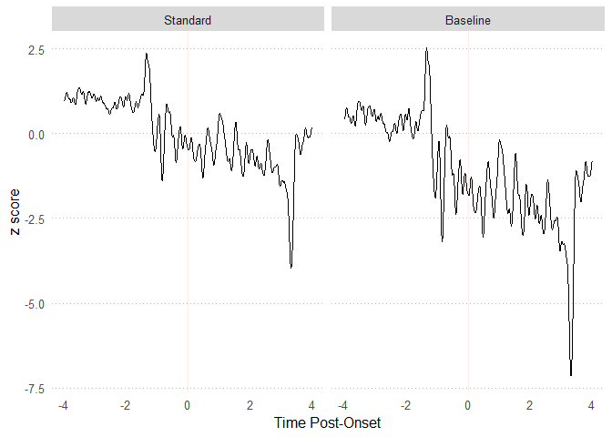
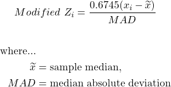
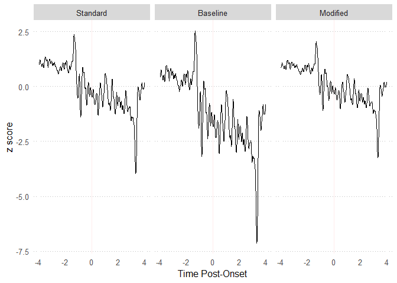

fluoR User Guide
================

Analyzing calcium indicator data is a multi-step process that can be
very confusing for both novices and seasoned scientists.

## Step 1: Convert to fluoR format

After exporting your recorded data from your preferred software
(e.g. MATLAB, Doric software), the first step is to convert your data
for quick use with the fluoR package. The `format_data` function is used
for this.

There are two formats of data supported as input:

<u><b> 1. Vertical format </u></b>

  - timestamps in the first column
  - one column for each trial’s recorded values

<u><b> 2. Horizontal format </u></b>

  - timestamps in the first row
  - one row for each trial’s recorded values

### How it works

The input can be a matrix or data frame - labeled or unlabeled. The
function detects whether the number of rows are greater than the number
of columns (vertical) and vice versa (horizontal).

If the input is horizontal, then the object is transposed to vertical
format. The table is then converted to a data frame, with each column
being labeled. This makes manually working with the data more convenient
and R-friendly.

### Output

The below table is an informal matrix representation of what the
returned data frame will look like.

-----

## Step 2: Standardize your data

There are many reasons to standardize your data before exploring your
data.

<b><u> 1. Signal differs between subjects </b></u>

  - Regardless of the specific technologies used, there is almost always
    differences in signal strength for each subject

<b><u> 2. Signal differs between trials </b></u>

  - The strength of recording signal tends to decay over time

<b><u> 3. Utilizing baseline values </b></u>

  - Using transformations such as percent change allows you to center
    the data at an objective value
  - After centering your trial and post-trial data, the data is
    interpreted as relative to baseline values
  - The baseline period is typically assumed to be a “resting” period
    prior to exposure to the experimental manipulation. This means that
    using standardization methods (particularly z-scores) also takes
    baseline <i>deviations</i> into consideration.

### Methods of Standardization

A little alteration in how we compute z-scores can make a large
difference.

#### z-scores

Consider the traditional z-score computation. This centers every value
(x) at the mean of the full time series (mu) and divides it by the
standard deviation of the full time series (sigma).

<!-- 
\begin{gather*}
  Baseline \ Z_{i} = \frac{x_{i}-\mu}{\sigma}
\end{gather*}
\begin{align*}
  \text{where...} \\
  \mu &= \text{mean of full sample,} \\
  \sigma &= \text{standard deviation of full sample} \\
\end{align*}
-->

This results in the same time series in terms of standard deviations
from the mean, all in the context of the full time series.

#### baseline z-scores

Using the baseline period as the input values for computing z-scores can
be useful in revealing differences from baseline that you may not find
by just comparing pre-trial and trial periods. This is in part because
baseline periods tend to have relatively low variability in general. As
you can see from the formula, a lower standard deviation will increase
the upper values - thus making changes in neural activity more apparent.

<!--
\begin{gather*}
  Baseline Z_{i} = \frac{x_{i}-\mu_{baseline}}{\sigma_{baseline}}
\end{gather*}
\begin{align*}
  \text{where...} \\
  \mu_{baseline} &= \text{mean of values from baseline period,} \\
  \sigma_{baseline} &= \text{standard deviation of values from baseline period} \\
\end{align*}
-->

This results in a time series interpreted in terms of standard
deviations and mean during the baseline period. Baseline z-scores are
conceptually justifiable because the standard deviation is then the
number of deviations from the mean when a subject is at rest. The values
outside of the baseline period will be different using this version, but
not within the baseline period.

<!-- -->

#### modified z scores

Waveform data fluctuates naturally. In the event of a change in activity
due to external stimuli, signal variation tends to rapidly increase
and/or decrease. Unless you are at a baseline period, the data is likely
not normally-distributed.

<!--
\begin{gather*}
  Modified \ Z_{i} = \frac{0.6745(x_{i}-\widetilde{x})}{MAD}
\end{gather*}
\begin{align*}
  \text{where...} \\
  \widetilde{x} &= \text{sample median,} \\
  MAD &= \text{median absolute deviation}
\end{align*}
-->

<!-- -->

<!--
## Step 3: Explore your data

## Step 4: Data analysis

When looking for changes in neural activity following exposure or cessation of exposure to a stimulus, it is crucial to compare this to a baseline period. Without a baseline to compare to, it is impossible to show that the experimental manipulation <i>caused</i> the change in activity.

#### How is 
-->
